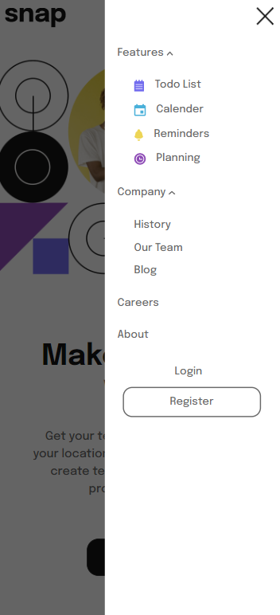

#  Intro section with dropdown navigation solution

## Table of contents

- [Overview](#overview)
  - [The challenge](#the-challenge)
  - [Screenshot](#screenshot)
  - [Links](#links)
- [My process](#my-process)
  - [Built with](#built-with)
  - [What I learned](#what-i-learned)
- [Author](#author)
- [Acknowledgments](#acknowledgments)

## Overview

### The challenge

Users should be able to:

- View the relevant dropdown menus on desktop and mobile when interacting with the navigation links
- View the optimal layout for the content depending on their device's screen size
- See hover states for all interactive elements on the page

### Screenshot

#### Screenshot - PC

#### Screenshot - Mobile

### Links

- Solution URL: [solution URL](https://github.com/akankshav108/intro-section-with-dropdown-navigation)
- Live Site URL: [live site](https://akankshav108.github.io/intro-section-with-dropdown-navigation/)

## My process

### Built with

- Semantic HTML5 markup
- CSS custom properties
- Flexbox
- JavaScript (ES6)

### What I learned

I learned more about ES6 and animation properties through this project.

## Author

- Website - Coming soon
- Frontend Mentor - [@akankshav108](https://www.frontendmentor.io/profile/akankshav108)

## Acknowledgments

I would like to acknowledge frontend mentor for providing this idea and various online platforms like stackoverflow for making my learing process easier.
